## Overview & The Tutorial Companion Paradigm

Traditional academic manuscripts necessarily operate under medium-induced constraints: complex mathematical algorithms, dynamic data-cleaning workflows, and psychometric heuristics are flattened into static prose and static two-dimensional figures. 

This companion notebook serves as an **interactive pedagogical hub**, designed to provide multimodal access to the detection of **Careless and Insufficient Effort Responding (C/IER)**. Rather than isolating educational assets in disconnected external repositories, this hub anchors visual slides, recorded lectures, algorithmic simulators, and open bibliographic databases directly within the reproducible manuscript architecture.

::: {.callout-note}
### Co-Creation with AI: The "Author-as-Curator" Model
All multimedia artifacts featured in this companion hub — including the standalone interactive HTML simulators, the comprehensive HTML master presentation, and the automated asset pipeline — were co-developed with generative AI assistance (**Gemini Notebook, Gemini 3.8 Flash, Antigravity**).

We present this notebook as a **reproducible blueprint for modern computational tutorial papers**:
1. **Generative AI as an Accelerator:** Generative AI drastically lowers the programming and design overhead required to craft sophisticated, interactive web widgets, animations, and educational media.
2. **The Author as Faithful Curator:** The domain expert (the researcher) provides theoretical guidance, mathematical verification, empirical validation, and pedagogical curation.

We warmly invite authors, educators, and psychometricians who master their respective methodological domains to adopt this paradigm: expand your future tutorial articles with rich companion hubs, turning static papers into living learning platforms.
:::

---

## 1. Conceptual Roadmap: Master Presentation & Visual Slide Deck

Before exploring algorithmic formulas or running command scripts, learners benefit from establishing a structured mental model of the C/IER problem space. The materials in this section synthesize:

* The psychometric foundations of inattention and how it systematically biases factor loadings, correlations, and reliability estimates.
* The sequential dual-tier screening architecture: **Level 1 (Procedural exclusions: dropouts, timing, attention checks)** versus **Level 2 (Diagnostic post-hoc indicators: Laz.R, Longstring, Mahalanobis Distance, IRV)**.
* Objective cut-off point determination via elbow/curvature identification.

::: {.content-visible when-format="html"}
::: {.panel-tabset}
### Master Presentation

The comprehensive HTML master presentation is engineered as an interactive seminar deck featuring slide transitions, high-resolution psychometric telemetry diagrams, live mathematical simulations, and full-screen controls across 15 structured modules.

Below is an interactive live preview scaled to the manuscript reading width. While readers can preview the deck directly within this viewport, we recommend launching it in a dedicated fullscreen tab for full keyboard navigation and uncompressed widescreen legibility.

```{=html}
<div class="presentation-embed-wrapper border rounded-3 overflow-hidden shadow-sm my-4" style="background: #ffffff; border: 1px solid #ced4da !important;">
  <!-- Header Action Bar (Light Mode) -->
  <div class="d-flex justify-content-between align-items-center px-3 py-2 flex-wrap gap-2" style="background: #f8f9fa; border-bottom: 1px solid #dee2e6;">
    <div class="d-flex align-items-center gap-2">
      <span class="badge text-bg-warning px-2 py-1" style="font-size: 0.75rem; font-weight: 700; letter-spacing: 0.04em;">
        LIVE PREVIEW
      </span>
      <span class="text-dark small fw-bold">16:9 Master Presentation Deck</span>
    </div>
    <a href="../../Resources/Media/cier_presentation.html" target="_blank" rel="noopener" class="btn btn-sm px-3 py-1" style="background: #F18C22; color: #ffffff; font-weight: 700; border-radius: 6px; box-shadow: 0 2px 8px rgba(241, 140, 34, 0.35);">
      <i class="bi bi-box-arrow-up-right me-1"></i> Launch Fullscreen Presentation
    </a>
  </div>

  <!-- Scaled Viewport Container (Dark Presentation Canvas) -->
  <div id="master-pres-viewport" style="position: relative; width: 100%; aspect-ratio: 16 / 10; overflow: hidden; background: #071318;">
    <iframe id="master-pres-iframe" 
            src="../../Resources/Media/cier_presentation.html" 
            title="C/IER Master Presentation Interactive Deck" 
            style="position: absolute; top: 0; left: 0; width: 1280px; height: 800px; border: none; transform-origin: top left;" 
            loading="lazy"
            allowfullscreen>
    </iframe>
  </div>

  <!-- Footer Info Bar (Light Mode) -->
  <div class="px-3 py-2 d-flex justify-content-between align-items-center flex-wrap gap-2" style="background: #f8f9fa; border-top: 1px solid #dee2e6; font-size: 0.82rem;">
    <span class="text-muted">
      <i class="bi bi-info-circle me-1 text-primary"></i> Scaled preview. Click buttons or tabs inside to preview, or use the fullscreen link for full-resolution presentation mode.
    </span>
    <a href="../../Resources/Media/cier_presentation.html" target="_blank" class="fw-bold text-decoration-none" style="color: #16777a;">
      Open in new tab <i class="bi bi-arrow-right ms-1"></i>
    </a>
  </div>
</div>

<script>
(function() {
  function adjustPresScale() {
    var viewport = document.getElementById('master-pres-viewport');
    var iframe = document.getElementById('master-pres-iframe');
    if (!viewport || !iframe) return;
    var baseW = 1280;
    var baseH = 800;
    var currentW = viewport.clientWidth;
    if (currentW <= 0) return;
    var scale = currentW / baseW;
    iframe.style.transform = 'scale(' + scale + ')';
    viewport.style.height = Math.round(baseH * scale) + 'px';
  }
  
  if (document.readyState === 'loading') {
    document.addEventListener('DOMContentLoaded', adjustPresScale);
  } else {
    adjustPresScale();
  }
  
  window.addEventListener('resize', adjustPresScale);
  document.querySelectorAll('button[data-bs-toggle="tab"], a[data-bs-toggle="tab"]').forEach(function(tab) {
    tab.addEventListener('shown.bs.tab', adjustPresScale);
  });
  setTimeout(adjustPresScale, 300);
  setTimeout(adjustPresScale, 1000);
})();
</script>
```

### Slide Deck Gallery

Browse the 15 slides for a quick preview or download the **PDF file** for the full presentation. This version is more concise than the **Master Presentation** alongside it.

```{=html}
<div class="slides-embed-wrapper border rounded-3 overflow-hidden shadow-sm my-4" style="background: #ffffff; border: 1px solid #ced4da !important;">
  <!-- Header Action Bar (Light Mode) -->
  <div class="d-flex justify-content-between align-items-center px-3 py-2 flex-wrap gap-2" style="background: #f8f9fa; border-bottom: 1px solid #dee2e6;">
    <div class="d-flex align-items-center gap-2">
      <span class="badge text-bg-warning px-2 py-1" style="font-size: 0.75rem; font-weight: 700; letter-spacing: 0.04em;">
        SLIDE DECK
      </span>
      <span class="text-dark small fw-bold">15-Slide Lecture Visual Gallery</span>
    </div>
    <a href="../../Resources/Media/cier_slides.pdf" download="cier_slides.pdf" onclick="downloadSlidesPdf(event)" class="btn btn-sm px-3 py-1" style="background: #F18C22; color: #ffffff; font-weight: 700; border-radius: 6px; box-shadow: 0 2px 8px rgba(241, 140, 34, 0.35);">
      <i class="bi bi-file-earmark-pdf-fill me-1"></i> Download Deck (PDF)
    </a>
  </div>

  <!-- Carousel Viewport (Dark Slide Canvas) -->
  <div id="slideshowCarousel" class="carousel slide bg-dark" data-bs-ride="false" style="width: 100%; margin: 0 auto;">
  <div class="carousel-indicators">
    <button type="button" data-bs-target="#slideshowCarousel" data-bs-slide-to="0" class="active" aria-current="true" aria-label="Slide 1"></button>
    <button type="button" data-bs-target="#slideshowCarousel" data-bs-slide-to="1" aria-label="Slide 2"></button>
    <button type="button" data-bs-target="#slideshowCarousel" data-bs-slide-to="2" aria-label="Slide 3"></button>
    <button type="button" data-bs-target="#slideshowCarousel" data-bs-slide-to="3" aria-label="Slide 4"></button>
    <button type="button" data-bs-target="#slideshowCarousel" data-bs-slide-to="4" aria-label="Slide 5"></button>
    <button type="button" data-bs-target="#slideshowCarousel" data-bs-slide-to="5" aria-label="Slide 6"></button>
    <button type="button" data-bs-target="#slideshowCarousel" data-bs-slide-to="6" aria-label="Slide 7"></button>
    <button type="button" data-bs-target="#slideshowCarousel" data-bs-slide-to="7" aria-label="Slide 8"></button>
    <button type="button" data-bs-target="#slideshowCarousel" data-bs-slide-to="8" aria-label="Slide 9"></button>
    <button type="button" data-bs-target="#slideshowCarousel" data-bs-slide-to="9" aria-label="Slide 10"></button>
    <button type="button" data-bs-target="#slideshowCarousel" data-bs-slide-to="10" aria-label="Slide 11"></button>
    <button type="button" data-bs-target="#slideshowCarousel" data-bs-slide-to="11" aria-label="Slide 12"></button>
    <button type="button" data-bs-target="#slideshowCarousel" data-bs-slide-to="12" aria-label="Slide 13"></button>
    <button type="button" data-bs-target="#slideshowCarousel" data-bs-slide-to="13" aria-label="Slide 14"></button>
    <button type="button" data-bs-target="#slideshowCarousel" data-bs-slide-to="14" aria-label="Slide 15"></button>
  </div>
  <div class="carousel-inner">
    <div class="carousel-item active text-center p-2">
      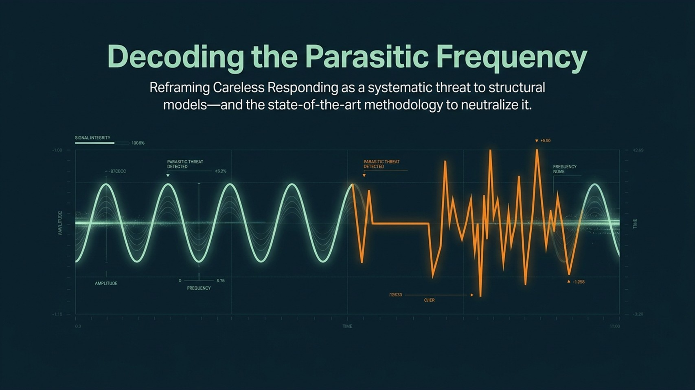
      <div class="carousel-caption d-none d-md-block bg-dark bg-opacity-75 rounded px-2 py-1 mt-2">Slide 1 of 15</div>
    </div>
    <div class="carousel-item text-center p-2">
      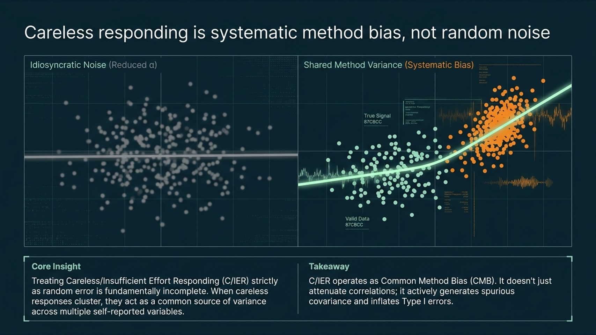
      <div class="carousel-caption d-none d-md-block bg-dark bg-opacity-75 rounded px-2 py-1 mt-2">Slide 2 of 15</div>
    </div>
    <div class="carousel-item text-center p-2">
      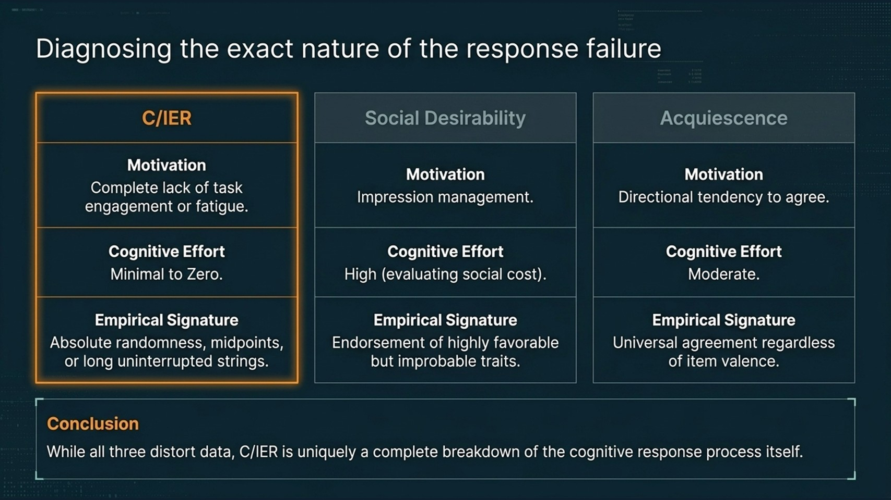
      <div class="carousel-caption d-none d-md-block bg-dark bg-opacity-75 rounded px-2 py-1 mt-2">Slide 3 of 15</div>
    </div>
    <div class="carousel-item text-center p-2">
      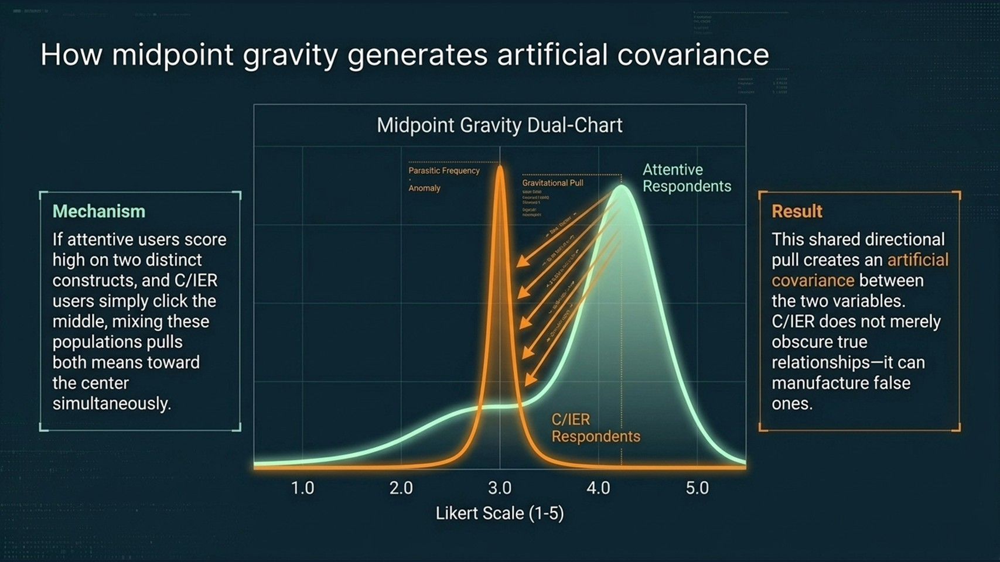
      <div class="carousel-caption d-none d-md-block bg-dark bg-opacity-75 rounded px-2 py-1 mt-2">Slide 4 of 15</div>
    </div>
    <div class="carousel-item text-center p-2">
      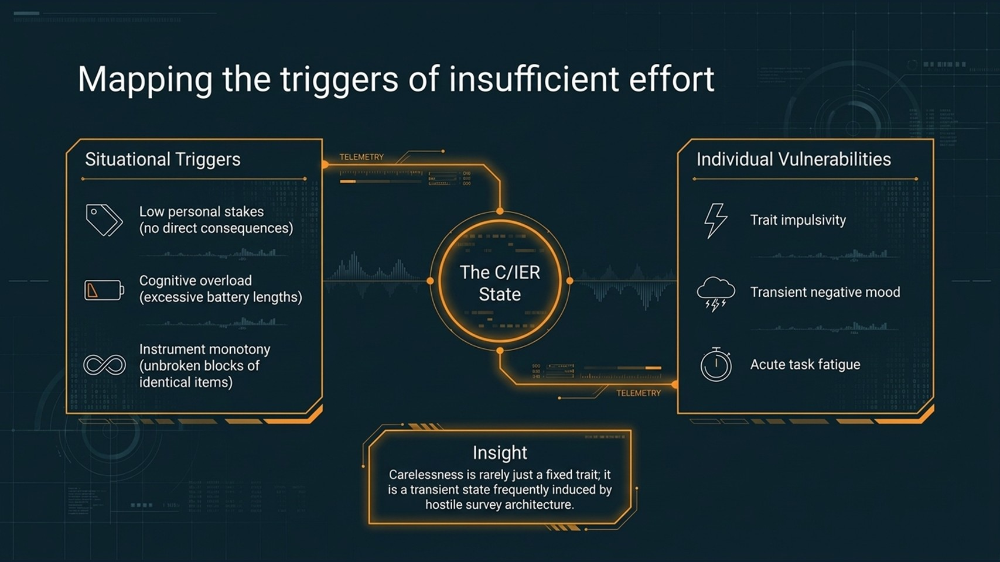
      <div class="carousel-caption d-none d-md-block bg-dark bg-opacity-75 rounded px-2 py-1 mt-2">Slide 5 of 15</div>
    </div>
    <div class="carousel-item text-center p-2">
      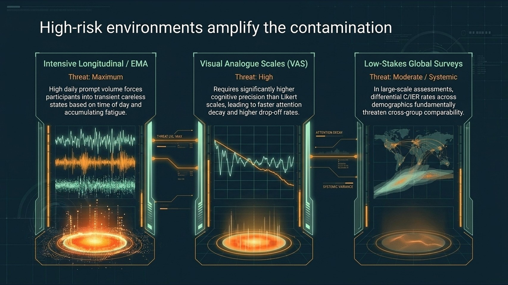
      <div class="carousel-caption d-none d-md-block bg-dark bg-opacity-75 rounded px-2 py-1 mt-2">Slide 6 of 15</div>
    </div>
    <div class="carousel-item text-center p-2">
      
      <div class="carousel-caption d-none d-md-block bg-dark bg-opacity-75 rounded px-2 py-1 mt-2">Slide 7 of 15</div>
    </div>
    <div class="carousel-item text-center p-2">
      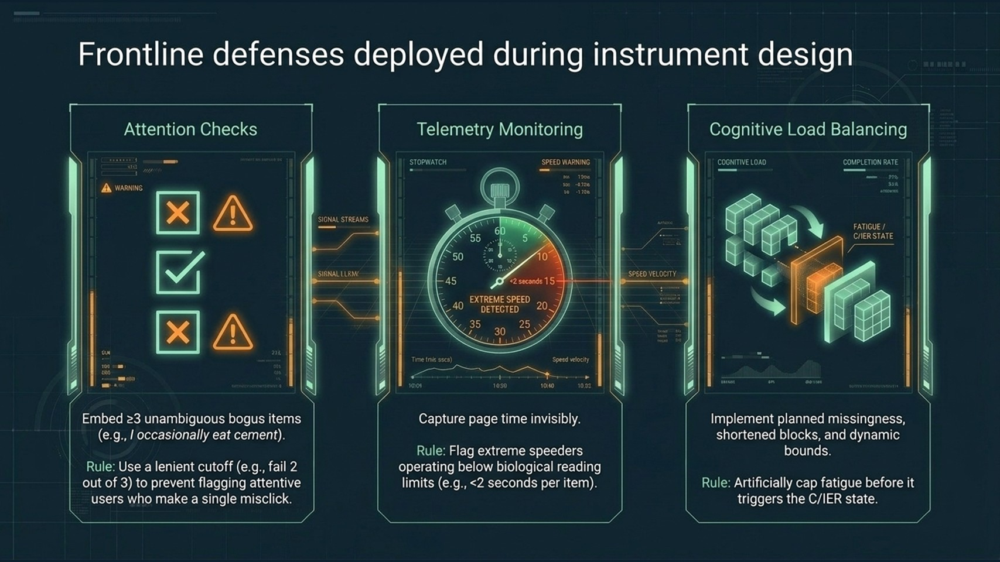
      <div class="carousel-caption d-none d-md-block bg-dark bg-opacity-75 rounded px-2 py-1 mt-2">Slide 8 of 15</div>
    </div>
    <div class="carousel-item text-center p-2">
      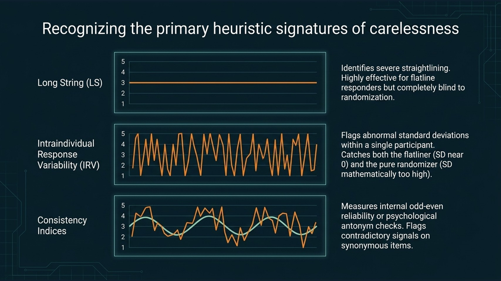
      <div class="carousel-caption d-none d-md-block bg-dark bg-opacity-75 rounded px-2 py-1 mt-2">Slide 9 of 15</div>
    </div>
    <div class="carousel-item text-center p-2">
      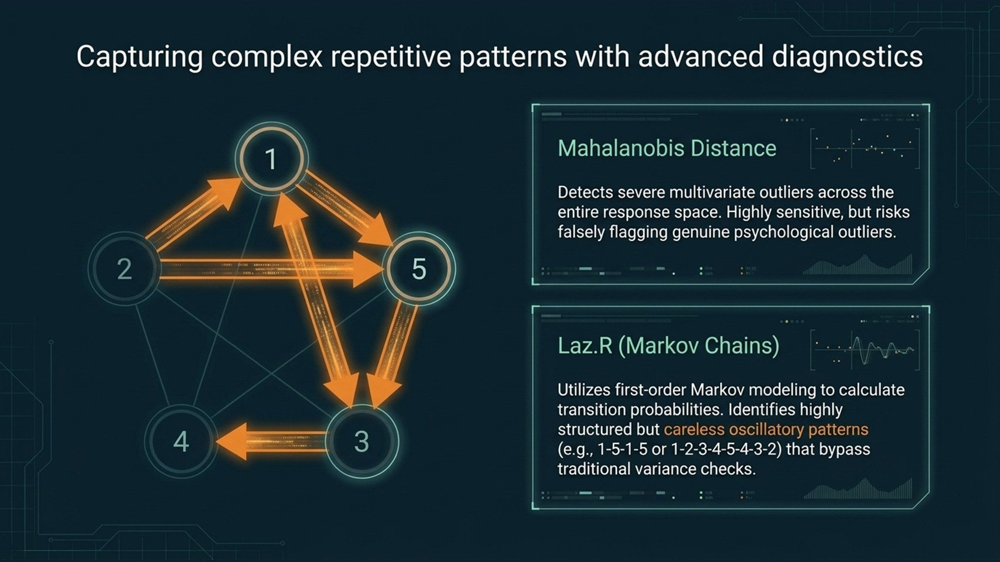
      <div class="carousel-caption d-none d-md-block bg-dark bg-opacity-75 rounded px-2 py-1 mt-2">Slide 10 of 15</div>
    </div>
    <div class="carousel-item text-center p-2">
      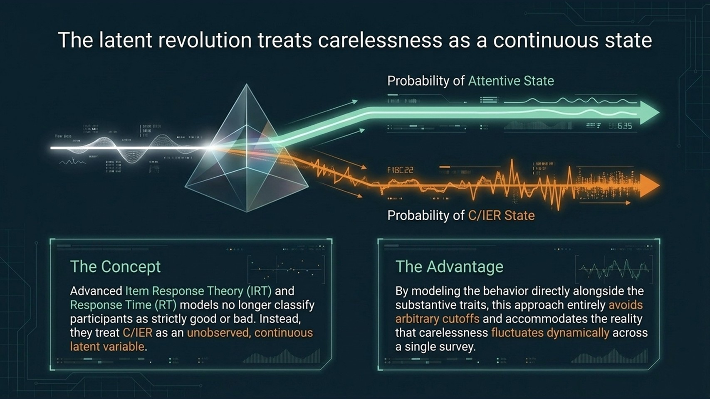
      <div class="carousel-caption d-none d-md-block bg-dark bg-opacity-75 rounded px-2 py-1 mt-2">Slide 11 of 15</div>
    </div>
    <div class="carousel-item text-center p-2">
      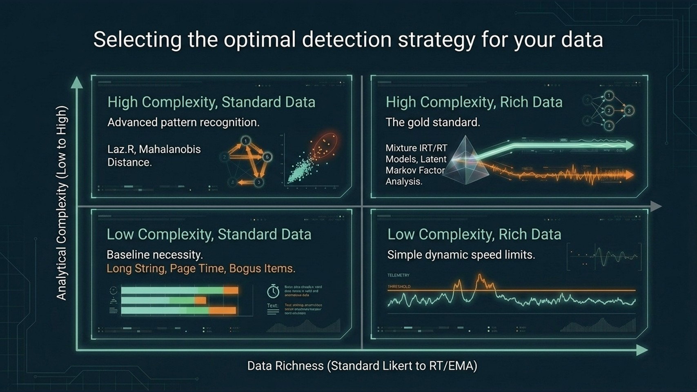
      <div class="carousel-caption d-none d-md-block bg-dark bg-opacity-75 rounded px-2 py-1 mt-2">Slide 12 of 15</div>
    </div>
    <div class="carousel-item text-center p-2">
      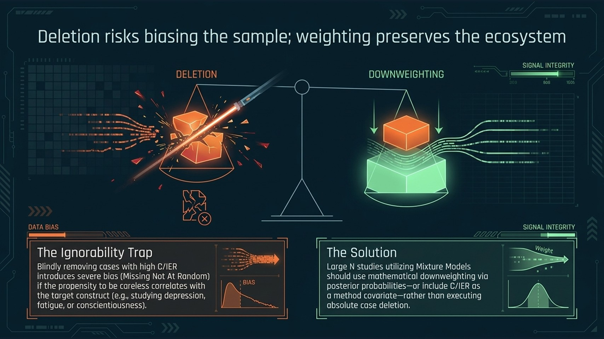
      <div class="carousel-caption d-none d-md-block bg-dark bg-opacity-75 rounded px-2 py-1 mt-2">Slide 13 of 15</div>
    </div>
    <div class="carousel-item text-center p-2">
      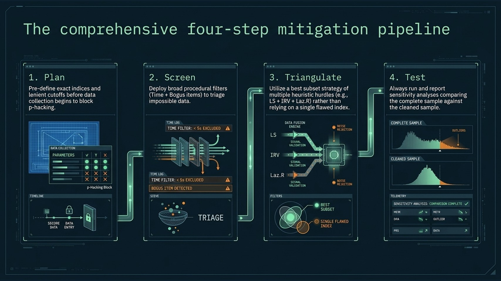
      <div class="carousel-caption d-none d-md-block bg-dark bg-opacity-75 rounded px-2 py-1 mt-2">Slide 14 of 15</div>
    </div>
    <div class="carousel-item text-center p-2">
      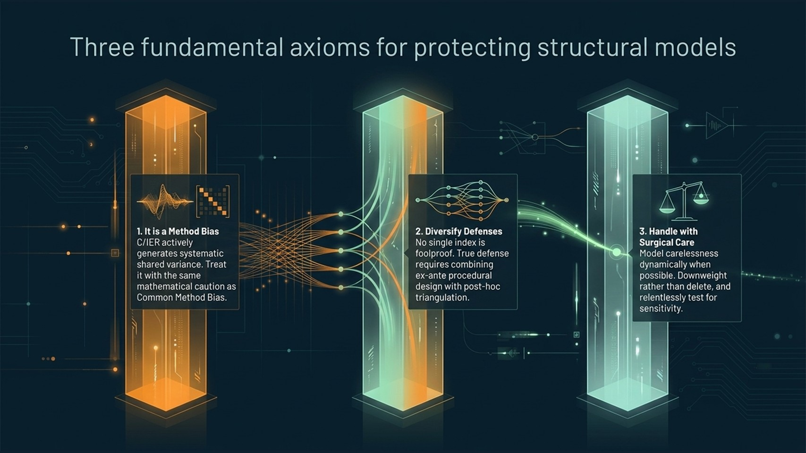
      <div class="carousel-caption d-none d-md-block bg-dark bg-opacity-75 rounded px-2 py-1 mt-2">Slide 15 of 15</div>
    </div>
  </div>
  <button class="carousel-control-prev" type="button" data-bs-target="#slideshowCarousel" data-bs-slide="prev">
    <span class="carousel-control-prev-icon" aria-hidden="true"></span>
    <span class="visually-hidden">Previous</span>
  </button>
  <button class="carousel-control-next" type="button" data-bs-target="#slideshowCarousel" data-bs-slide="next">
    <span class="carousel-control-next-icon" aria-hidden="true"></span>
    <span class="visually-hidden">Next</span>
  </button>
  </div>

  <!-- Footer Info Bar (Light Mode) -->
  <div class="px-3 py-2 d-flex justify-content-between align-items-center flex-wrap gap-2" style="background: #f8f9fa; border-top: 1px solid #dee2e6; font-size: 0.82rem;">
    <span class="text-muted">
      <i class="bi bi-info-circle me-1 text-primary"></i> 15 visual lecture slides. Use arrows to browse or download the complete slide deck for offline presentations.
    </span>
    <a href="../../Resources/Media/cier_slides.pdf" download="cier_slides.pdf" onclick="downloadSlidesPdf(event)" class="fw-bold text-decoration-none" style="color: #16777a;">
      Download cier_slides.pdf (1.3 MB) <i class="bi bi-download ms-1"></i>
    </a>
  </div>
</div>

<script>
async function downloadSlidesPdf(e) {
  if (e) e.preventDefault();
  var pdfUrl = '../../Resources/Media/cier_slides.pdf';
  var fileName = 'cier_slides.pdf';

  // 1. Try modern File System Access API (native Windows Save As folder selection dialog)
  if (window.showSaveFilePicker) {
    try {
      const res = await fetch(pdfUrl);
      if (!res.ok) throw new Error('Fetch failed');
      const blob = await res.blob();
      const handle = await window.showSaveFilePicker({
        suggestedName: fileName,
        types: [{
          description: 'PDF Document (*.pdf)',
          accept: { 'application/pdf': ['.pdf'] }
        }]
      });
      const writable = await handle.createWritable();
      await writable.write(blob);
      await writable.close();
      return;
    } catch (err) {
      if (err.name === 'AbortError') return; // User cancelled the save dialog
    }
  }

  // 2. Blob URL download (forces download in modern browsers without navigating the tab)
  try {
    const res = await fetch(pdfUrl);
    if (!res.ok) throw new Error('Fetch failed');
    const blob = await res.blob();
    const blobUrl = URL.createObjectURL(blob);
    const a = document.createElement('a');
    a.style.display = 'none';
    a.href = blobUrl;
    a.download = fileName;
    document.body.appendChild(a);
    a.click();
    setTimeout(function() {
      URL.revokeObjectURL(blobUrl);
      document.body.removeChild(a);
    }, 400);
  } catch (err) {
    // 3. Fallback: programmatic anchor click in separate target
    const a = document.createElement('a');
    a.href = pdfUrl;
    a.download = fileName;
    a.target = '_blank';
    document.body.appendChild(a);
    a.click();
    document.body.removeChild(a);
  }
}
</script>
```
:::
:::

::: {.content-visible unless-format="html"}
> 💡 **Presentation & Slides:** Available interactively in the web edition of this manuscript.
:::

---

## 2. Guided Demonstration: Video Lecture & Methodological Walkthrough

Audio-visual demonstrations provide pedagogical pacing and practical nuance that static text alone cannot replicate. This lecture examines the pervasive threat of **Insufficient Effort Responding (IER)** in survey-based psychometric research, explaining why careless responding systematically distorts empirical findings and outlining actionable frameworks for detection, prevention, and statistical mitigation.

### Key Lecture Highlights

* **Conceptual Foundations of IER** `(0:00 – 0:13)`: Operationalizing how participant inattention manifests through arbitrary option picking, repetitive response trajectories, and cognitive satisficing.
* **Substantive Statistical Distortion & Type I Errors** `(1:00 – 1:52)`: Clarifying why IER is fundamentally distinct from classical random error. While true random noise merely attenuates effect sizes, inattentive response patterns introduce systematic method variance that can spuriously inflate bivariate correlations and lead to false-positive conclusions (Type I errors).
* **Vulnerable Survey Architectures** `(3:35 – 4:45)`: Identifying high-risk data-collection protocols—such as lengthy questionnaire batteries, cognitively demanding scale items, and high-frequency longitudinal designs (e.g., Ecological Momentary Assessment, EMA) — where respondent fatigue escalates rapidly.
* **Diagnostic Screening Methods** `(5:03 – 6:15)`: Reviewing classical post-hoc heuristic indicators, including **Longstring** (detecting invariant sequential responding) and **Intra-individual Response Variability (IRV)**, alongside modern psychometric formulations like **latent response mixture models**.
* **Design Prevention & Analytical Mitigation** `(6:28 – 8:05)`: Formulating proactive design safeguards (e.g., limiting problematic reverse-coded items and leveraging planned missingness architectures) as well as analytical treatments, such as weighting cases by mixture posterior probabilities rather than relying solely on blunt listwise deletion.



---

## 3. Intuition Engines: Interactive Simulations & Algorithmic Sandboxes

Mathematical formulations often mask intuitive geometry. The three standalone interactive web tools below enable learners to explore parameter spaces, inspect transition probability matrices, and visualize curvature geometry dynamically in the browser.

::: {.content-visible when-format="html"}
::: {.panel-tabset}
### Laz.R Explorer

The **Laz.R (Lazy Respondent)** index [@biemann2025] leverages first-order Markov chains to capture subtle, alternating, or diagonal response patterns that completely bypass traditional frequency- or length-based metrics (such as Longstring). 

* **How to use:** Alter response patterns, observe how the transition matrix $P_{ij}$ updates, and inspect the resulting Laz.R score relative to random and attentive benchmarks.

```{=html}
<div class="interactive-embed-wrapper border rounded-3 overflow-hidden shadow-sm my-3" style="background: #153743; border-color: rgba(22, 119, 122, 0.35) !important;">
  <!-- Header Action Bar -->
  <div class="d-flex justify-content-between align-items-center px-3 py-2 flex-wrap gap-2" style="background: #153743; border-bottom: 1px solid rgba(22, 119, 122, 0.25);">
    <div class="d-flex align-items-center gap-2">
      <span class="badge rounded-pill text-bg-warning px-2 py-1" style="font-size: 0.75rem; font-weight: 700; letter-spacing: 0.04em;">
        LIVE PREVIEW
      </span>
      <span class="text-white small fw-bold">Laz.R Index Interactive Explorer</span>
    </div>
    <a href="../../Resources/Interactive/lazyR.html" target="_blank" rel="noopener" class="btn btn-sm px-3 py-1" style="background: #e98226; color: #ffffff; font-weight: 700; border-radius: 6px; box-shadow: 0 2px 8px rgba(233, 130, 38, 0.35);">
      <i class="bi bi-box-arrow-up-right me-1"></i> Launch in New Tab
    </a>
  </div>

  <!-- Scaled Viewport Container -->
  <div class="interactive-preview-viewport" data-base-w="1200" data-base-h="820" style="position: relative; width: 100%; overflow: hidden; background: #f7f4ec;">
    <iframe class="interactive-preview-iframe"
            src="../../Resources/Interactive/lazyR.html" 
            title="Laz.R Index Interactive Explorer" 
            style="position: absolute; top: 0; left: 0; width: 1200px; height: 820px; border: none; transform-origin: top left;" 
            loading="lazy"
            allowfullscreen>
    </iframe>
  </div>

  <!-- Footer Info Bar (Dark Mode - matching topbar) -->
  <div class="px-3 py-2 d-flex justify-content-between align-items-center flex-wrap gap-2" style="background: #153743; border-top: 1px solid rgba(22, 119, 122, 0.25); font-size: 0.82rem;">
    <span style="color: #a2d8d9;">
      <i class="bi bi-info-circle me-1" style="color: #f7a54c;"></i> Scaled preview. For full interactive calculation, step-by-step presets, and report printing, launch in a dedicated tab.
    </span>
    <a href="../../Resources/Interactive/lazyR.html" target="_blank" class="fw-bold text-decoration-none" style="color: #f7a54c;">
      Open in new tab <i class="bi bi-arrow-right ms-1"></i>
    </a>
  </div>
</div>
```

### Kneedle: Simulated

Rather than relying on arbitrary rules of thumb (e.g., sample standard deviations or rigid percentiles), the **Kneedle algorithm** [@biemann2025] mathematically locates the point of maximum curvature — the "knee" or "elbow" — along an ordered indicator curve.

* **How to use:** Advance through the sequential steps by clicking Next → (or the numbered step tabs) to observe how the algorithm normalizes the coordinate space, projects the diagonal chord, computes the difference vector, and isolates the mathematical point of maximum curvature.

```{=html}
<div class="interactive-embed-wrapper border rounded-3 overflow-hidden shadow-sm my-3" style="background: #153743; border-color: rgba(22, 119, 122, 0.35) !important;">
  <!-- Header Action Bar -->
  <div class="d-flex justify-content-between align-items-center px-3 py-2 flex-wrap gap-2" style="background: #153743; border-bottom: 1px solid rgba(22, 119, 122, 0.25);">
    <div class="d-flex align-items-center gap-2">
      <span class="badge rounded-pill text-bg-warning px-2 py-1" style="font-size: 0.75rem; font-weight: 700; letter-spacing: 0.04em;">
        LIVE PREVIEW
      </span>
      <span class="text-white small fw-bold">Kneedle Algorithm — Simulated Geometry Sandbox</span>
    </div>
    <a href="../../Resources/Interactive/kneedle_sim.html" target="_blank" rel="noopener" class="btn btn-sm px-3 py-1" style="background: #e98226; color: #ffffff; font-weight: 700; border-radius: 6px; box-shadow: 0 2px 8px rgba(233, 130, 38, 0.35);">
      <i class="bi bi-box-arrow-up-right me-1"></i> Launch in New Tab
    </a>
  </div>

  <!-- Scaled Viewport Container -->
  <div class="interactive-preview-viewport" data-base-w="1200" data-base-h="820" style="position: relative; width: 100%; overflow: hidden; background: #f7f4ec;">
    <iframe class="interactive-preview-iframe"
            src="../../Resources/Interactive/kneedle_sim.html" 
            title="Kneedle Algorithm - Simulated Data" 
            style="position: absolute; top: 0; left: 0; width: 1200px; height: 820px; border: none; transform-origin: top left;" 
            loading="lazy"
            allowfullscreen>
    </iframe>
  </div>

  <!-- Footer Info Bar (Dark Mode - matching topbar) -->
  <div class="px-3 py-2 d-flex justify-content-between align-items-center flex-wrap gap-2" style="background: #153743; border-top: 1px solid rgba(22, 119, 122, 0.25); font-size: 0.82rem;">
    <span style="color: #a2d8d9;">
      <i class="bi bi-info-circle me-1" style="color: #f7a54c;"></i> Scaled preview. For parameter tuning, dynamic noise simulations, and step-by-step mathematical walkthroughs, launch in a dedicated tab.
    </span>
    <a href="../../Resources/Interactive/kneedle_sim.html" target="_blank" class="fw-bold text-decoration-none" style="color: #f7a54c;">
      Open in new tab <i class="bi bi-arrow-right ms-1"></i>
    </a>
  </div>
</div>
```

### Kneedle: Empirical

Explore the Kneedle algorithm applied directly to the empirical research sample ($n = 1,295$, WHOQOL dataset) analyzed in this tutorial. 

* **How to use:** Advance through the guided walkthrough using Next → (or the numbered step indicators) to observe how the algorithm locates the empirical inflection point on the tutorial sample ($n = 1,295$) and separates attentive respondents from careless outliers.

```{=html}
<div class="interactive-embed-wrapper border rounded-3 overflow-hidden shadow-sm my-3" style="background: #153743; border-color: rgba(22, 119, 122, 0.35) !important;">
  <!-- Header Action Bar -->
  <div class="d-flex justify-content-between align-items-center px-3 py-2 flex-wrap gap-2" style="background: #153743; border-bottom: 1px solid rgba(22, 119, 122, 0.25);">
    <div class="d-flex align-items-center gap-2">
      <span class="badge rounded-pill text-bg-warning px-2 py-1" style="font-size: 0.75rem; font-weight: 700; letter-spacing: 0.04em;">
        LIVE PREVIEW
      </span>
      <span class="text-white small fw-bold">Kneedle Algorithm — Empirical Dataset Sandbox (n = 1,546)</span>
    </div>
    <a href="../../Resources/Interactive/kneedle_real.html" target="_blank" rel="noopener" class="btn btn-sm px-3 py-1" style="background: #e98226; color: #ffffff; font-weight: 700; border-radius: 6px; box-shadow: 0 2px 8px rgba(233, 130, 38, 0.35);">
      <i class="bi bi-box-arrow-up-right me-1"></i> Launch in New Tab
    </a>
  </div>

  <!-- Scaled Viewport Container -->
  <div class="interactive-preview-viewport" data-base-w="1200" data-base-h="820" style="position: relative; width: 100%; overflow: hidden; background: #f7f4ec;">
    <iframe class="interactive-preview-iframe"
            src="../../Resources/Interactive/kneedle_real.html" 
            title="Kneedle Algorithm - Empirical Dataset" 
            style="position: absolute; top: 0; left: 0; width: 1200px; height: 820px; border: none; transform-origin: top left;" 
            loading="lazy"
            allowfullscreen>
    </iframe>
  </div>

  <!-- Footer Info Bar (Dark Mode - matching topbar) -->
  <div class="px-3 py-2 d-flex justify-content-between align-items-center flex-wrap gap-2" style="background: #153743; border-top: 1px solid rgba(22, 119, 122, 0.25); font-size: 0.82rem;">
    <span style="color: #a2d8d9;">
      <i class="bi bi-info-circle me-1" style="color: #f7a54c;"></i> Scaled preview. For full indicator inspection across all four metrics and respondent-level classification, launch in a dedicated tab.
    </span>
    <a href="../../Resources/Interactive/kneedle_real.html" target="_blank" class="fw-bold text-decoration-none" style="color: #f7a54c;">
      Open in new tab <i class="bi bi-arrow-right ms-1"></i>
    </a>
  </div>
</div>
```
:::
:::

```{=html}
<script>
(function() {
  function adjustInteractiveScale() {
    document.querySelectorAll('.interactive-preview-viewport').forEach(function(vp) {
      var iframe = vp.querySelector('.interactive-preview-iframe');
      if (!iframe) return;
      var baseW = parseFloat(vp.getAttribute('data-base-w')) || 1200;
      var baseH = parseFloat(vp.getAttribute('data-base-h')) || 820;
      var w = vp.clientWidth;
      if (w > 0) {
        var scale = w / baseW;
        iframe.style.transform = 'scale(' + scale + ')';
        vp.style.height = Math.round(baseH * scale) + 'px';
      }
    });
  }

  if (document.readyState === 'loading') {
    document.addEventListener('DOMContentLoaded', adjustInteractiveScale);
  } else {
    adjustInteractiveScale();
  }

  window.addEventListener('resize', adjustInteractiveScale);
  
  document.querySelectorAll('button[data-bs-toggle="tab"], a[data-bs-toggle="tab"]').forEach(function(tab) {
    tab.addEventListener('shown.bs.tab', function() {
      setTimeout(adjustInteractiveScale, 60);
    });
  });

  setTimeout(adjustInteractiveScale, 200);
  setTimeout(adjustInteractiveScale, 800);
})();
</script>
```

::: {.content-visible unless-format="html"}
> 💡 **Interactive Simulators:** Available interactively in the web edition of this manuscript.
:::

---

## 4. Living Scientific Memory: The Curated Zotero Group Library

The scientific literature on survey inattention spans psychological measurement, organizational behavior, marketing, and psychometrics. To provide an open and continuously maintained bibliographic repository that outlives any single publication date, we curate a dedicated public **Zotero Group Library**.

```{=html}
<div class="card my-4 border-0 shadow-sm overflow-hidden" style="border-radius: 12px; border: 1px solid rgba(22, 119, 122, 0.25) !important; background: #ffffff;">
  <!-- Card Header -->
  <div class="px-4 py-3 d-flex justify-content-between align-items-center flex-wrap gap-2" style="background: linear-gradient(135deg, #153743 0%, #1c4453 100%);">
    <div class="d-flex align-items-center gap-2">
      <span class="badge rounded-pill text-bg-warning px-2 py-1" style="font-size: 0.75rem; font-weight: 700; letter-spacing: 0.04em;">
        OPEN ACCESS REPOSITORY
      </span>
      <span class="text-white fw-bold">Zotero Group Library</span>
    </div>
    <a href="https://www.zotero.org/groups/6646768/ier_references/library" target="_blank" rel="noopener" class="btn btn-sm px-3 py-1" style="background: #e98226; color: #ffffff; font-weight: 700; border-radius: 6px; box-shadow: 0 2px 8px rgba(233, 130, 38, 0.35);">
      <i class="bi bi-box-arrow-up-right me-1"></i> Access Zotero Library
    </a>
  </div>

  <!-- Card Body -->
  <div class="p-4" style="background: #fdfcf9;">
    <div class="row g-4 align-items-center">
      <div class="col-lg-8">
        <h4 class="fw-bold mb-2" style="color: #10252d;">
          Curated Bibliographic Memory: <code style="color: #16777a; font-size: 1.05rem;">ier_references</code>
        </h4>
        <p class="text-muted mb-3" style="line-height: 1.6; font-size: 0.95rem;">
          The scientific literature on survey inattention spans psychological measurement, organizational behavior, marketing, and psychometrics. This public Zotero Group repository maintains an updated, living corpus of foundational methodology, recent algorithmic breakthroughs, and person-fit detection benchmarks.
        </p>
        <div class="d-flex flex-wrap gap-2 mb-2">
          <span class="badge border text-dark" style="background: #ffffff; border-color: #d7d2c5 !important;">
            <i class="bi bi-tag-fill me-1 text-primary"></i> Markov Chains & Laz.R
          </span>
          <span class="badge border text-dark" style="background: #ffffff; border-color: #d7d2c5 !important;">
            <i class="bi bi-tag-fill me-1 text-primary"></i> Curvature & Kneedle
          </span>
          <span class="badge border text-dark" style="background: #ffffff; border-color: #d7d2c5 !important;">
            <i class="bi bi-tag-fill me-1 text-primary"></i> Mahalanobis & Distance
          </span>
          <span class="badge border text-dark" style="background: #ffffff; border-color: #d7d2c5 !important;">
            <i class="bi bi-tag-fill me-1 text-primary"></i> Procedural Controls
          </span>
        </div>
      </div>
      <div class="col-lg-4 text-center text-lg-end">
        <div class="p-3 rounded-3 border" style="background: #ffffff; border-color: #e9ecef !important; display: inline-block; text-align: left; width: 100%; max-width: 280px; box-shadow: 0 4px 12px rgba(0,0,0,0.04);">
          <div class="small text-muted fw-bold mb-1 text-uppercase" style="font-size: 0.72rem; letter-spacing: 0.05em;">Repository Details</div>
          <div class="mb-1"><strong class="small text-dark">Group Name:</strong> <code class="small text-primary">ier_references</code></div>
          <div class="mb-1"><strong class="small text-dark">Type:</strong> <span class="badge text-bg-success" style="font-size: 0.7rem;">Public Open Group</span></div>
          <div class="mb-2"><strong class="small text-dark">Access:</strong> <span class="small text-muted">Free, Instant Sync</span></div>
          <a href="https://www.zotero.org/groups/6646768/ier_references/library" target="_blank" class="btn btn-outline-dark btn-sm w-100 fw-bold" style="border-color: #153743; color: #153743;">
            <i class="bi bi-collection me-1"></i> Open Collection
          </a>
        </div>
      </div>
    </div>
  </div>

  <!-- Card Footer (Dark Mode - matching topbar) -->
  <div class="px-4 py-2 d-flex justify-content-between align-items-center flex-wrap gap-2" style="background: #153743; border-top: 1px solid rgba(22, 119, 122, 0.25); font-size: 0.82rem;">
    <span style="color: #a2d8d9;">
      <i class="bi bi-cloud-arrow-down me-1" style="color: #f7a54c;"></i> Seamlessly synchronizes with personal Zotero, Mendeley, or EndNote reference managers.
    </span>
    <a href="https://www.zotero.org/groups/6646768/ier_references/library" target="_blank" class="fw-bold text-decoration-none" style="color: #f7a54c;">
      zotero.org/groups/6646768/ier_references <i class="bi bi-box-arrow-up-right ms-1"></i>
    </a>
  </div>
</div>
```

---

## 5. Epilogue: A Call to Action for Tutorial Authors

This tutorial project represents an intentional departure from traditional static publication models. By coupling...

1. **The Scientific Paper (`index.qmd`):** Formal psychometric theory, empirical methodology, and peer-reviewed rigor;
2. **Computational Reproducibility (TIER Protocol 4.0 + Quarto Manuscript + `renv`):** Transparent scripts, frozen analytical environments, and auditable pipelines;
3. **The Pedagogical Companion Hub (`03_resources.qmd`):** Multimodal media, interactive simulators, recorded lectures, and living bibliographic repositories;

... we establish a comprehensive, accessible learning experience.

### Join the Movement: The Author-as-Curator Blueprint

The rapid evolution of Generative AI tools has profoundly shifted the economics of educational content creation. Tasks that once required specialized front-end engineering teams—building responsive interactive mathematical sandboxes, crafting tailored slide presentation applications, and developing automated asset synchronizers—can now be generated collaboratively in hours.

The irreplaceable ingredient remains **human domain expertise**: the conceptual vision, the pedagogical judgment, and the scientific curation.

We invite authors and researchers developing tutorials across all computational and empirical disciplines: **do not stop at the PDF**. Equip your next paper with an interactive companion hub. Turn your methods into intuition, your code into exploration, and your scholarship into an open classroom.

## References {.unnumbered}

::: {#refs}
:::
