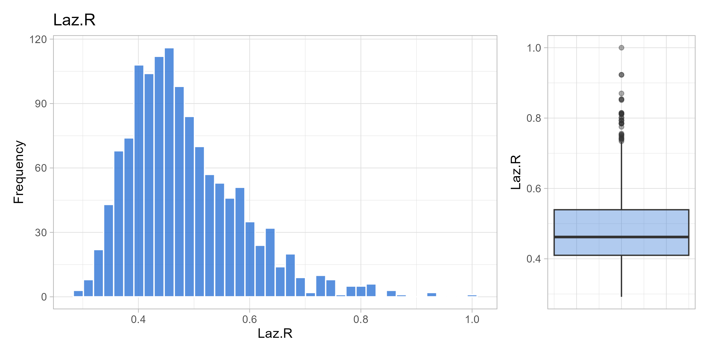
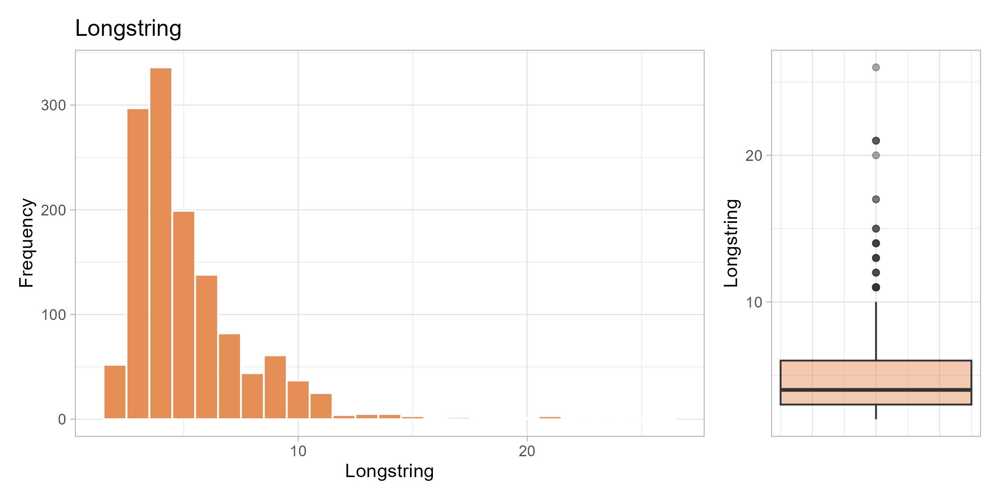
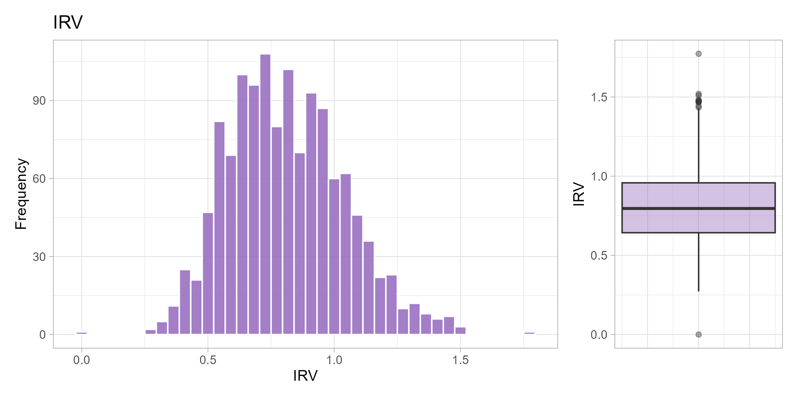
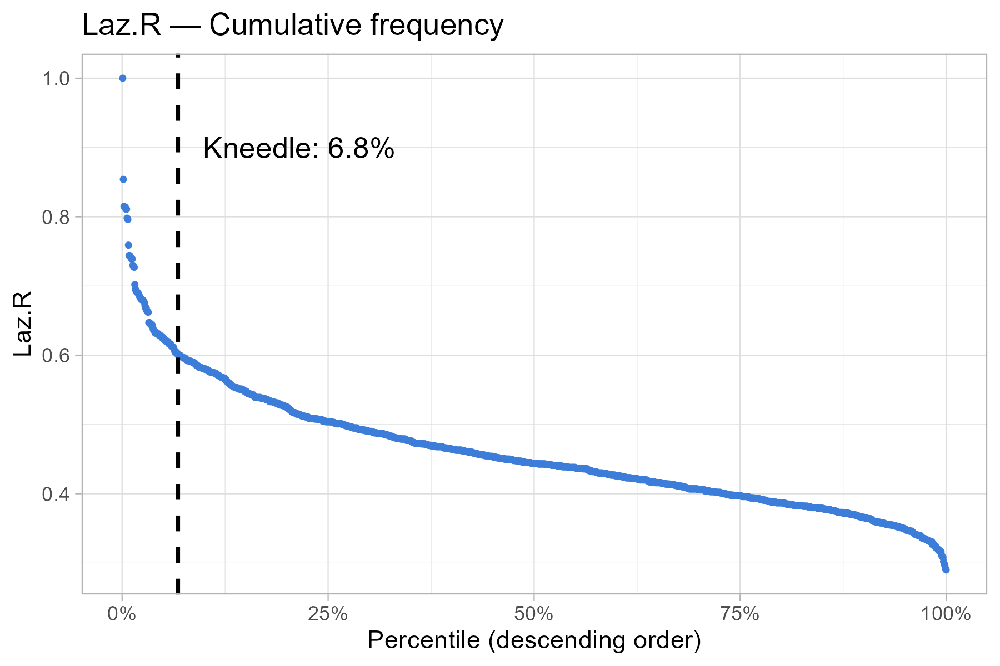
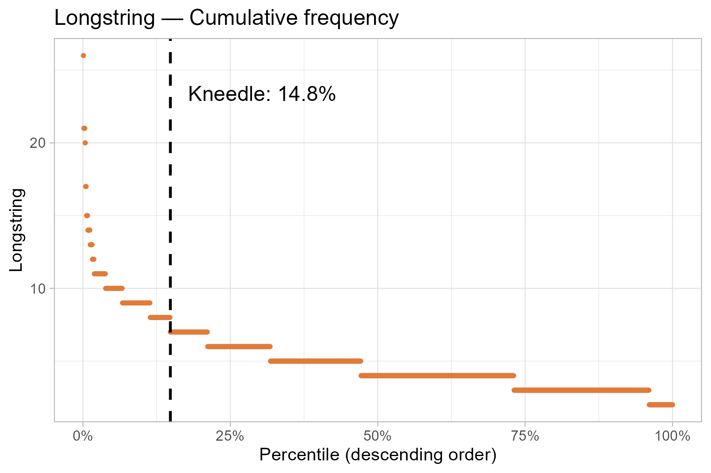
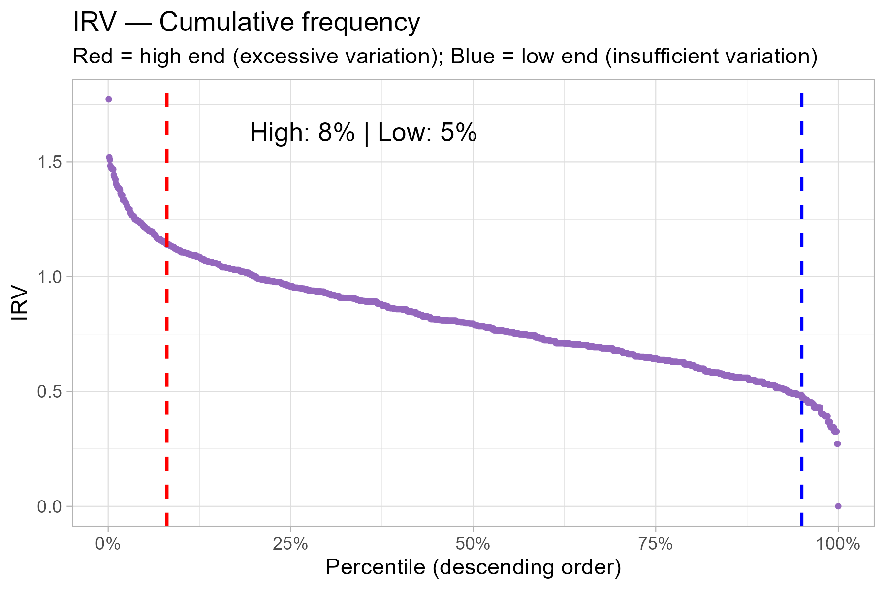

## Contextualization

The detection of Careless or Insufficient Effort Responding (C/IER) is an
essential step in the quality control of data obtained through self-report
questionnaires. C/IER occurs when respondents complete the instrument without
attention to the item content, compromising the validity of the psychometric
and substantive inferences derived from the data [@curran2016; @huang2026].

The analytical flow of this document follows two sequential levels of detection:

1. **Questionnaire:** procedural exclusions (a priori), including dropout,
   response time, and quality control items.
2. **WHOQOL Scale:** diagnostic post-hoc indicators (Laz.R, Longstring,
   Mahalanobis Distance, and IRV) with cut-off points estimated via the 
   Kneedle algorithm [@biemann2025].

## Data reading and preparation

The `data.csv` file contains the raw survey responses (separator `;`).
In this step, dropout records are removed, variables for the analytical flow
are selected, and the total response time (`TIME`) is derived.



## Procedural exclusions

Level 1 applies three procedures prior to calculating post-hoc indicators:
dropout removal, exclusion for response time below 208 seconds
(104 items × 2 s/item) [@huang2026], and exclusion for two or more failures
on quality control items (`CQ1-CQ3`) [@curran2016]. Every exclusion is
recorded in `exclusion_log.csv` with its reason and criterion.



## Calculation of C/IER indicators

Each indicator captures distinct manifestations of C/IER; their concurrent
presence offers stronger evidence than any single indicator alone [@curran2016;
@hong2020; @huang2026].

### Univariate visualization

Each respondent receives the values of the four indicators in a consolidated
tibble, and the plots below show the univariate distribution of each one.

::: {.panel-tabset}

#### Laz.R

{fig-alt="Histogram and boxplot of the Laz.R distribution."}

#### Longstring

{fig-alt="Histogram and boxplot of the Longstring distribution."}

#### Mahalanobis Distance

{fig-alt="Histogram and boxplot of the Mahalanobis distance distribution."}

#### IRV

{fig-alt="Histogram and boxplot of the IRV distribution."}

:::

### Cut-off points via Kneedle algorithm

The Kneedle algorithm is applied to the sorted (descending) curve of each indicator.
For **Laz.R**, **Longstring**, and **MD**, kneedle with `sign = -1` identifies
where extremely high values separate from the majority (right tail).
For **IRV**, `sign = -1` is used to detect excessively high IRV and
`sign = +1` for excessively low IRV, since both extremes can be considered suspicious.



### Plots with cut-off points

::: {.panel-tabset}

#### Laz.R

{fig-alt="Cumulative Laz.R curve with the Kneedle cut-off point."}

#### Longstring

{fig-alt="Cumulative Longstring curve with the Kneedle cut-off point."}

#### Mahalanobis Distance

{fig-alt="Cumulative Mahalanobis distance curve with the Kneedle cut-off point."}

#### IRV

{fig-alt="Cumulative IRV curve with the high and low Kneedle cut-off points."}

:::

### C/IER Flags

For each indicator, a `_FLAG` variable is created (`1` = flagged,
`0` = not flagged) based on the Kneedle cut-off points.

> **Note:** Post-hoc indicators are **diagnostic**, they do not trigger automatic
> exclusion in this phase. The composite flag array will be used for inspection and
> evaluation through the `whoqol_screened.csv` file.


