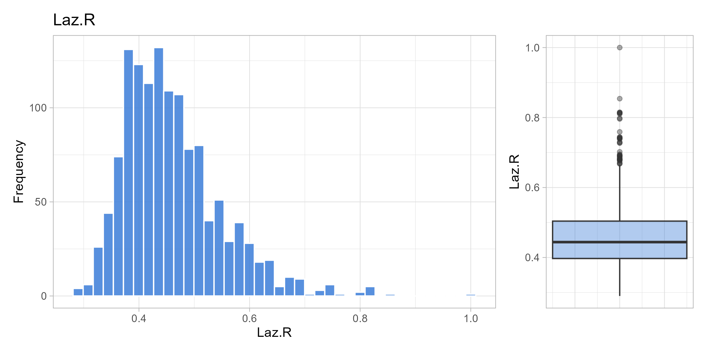
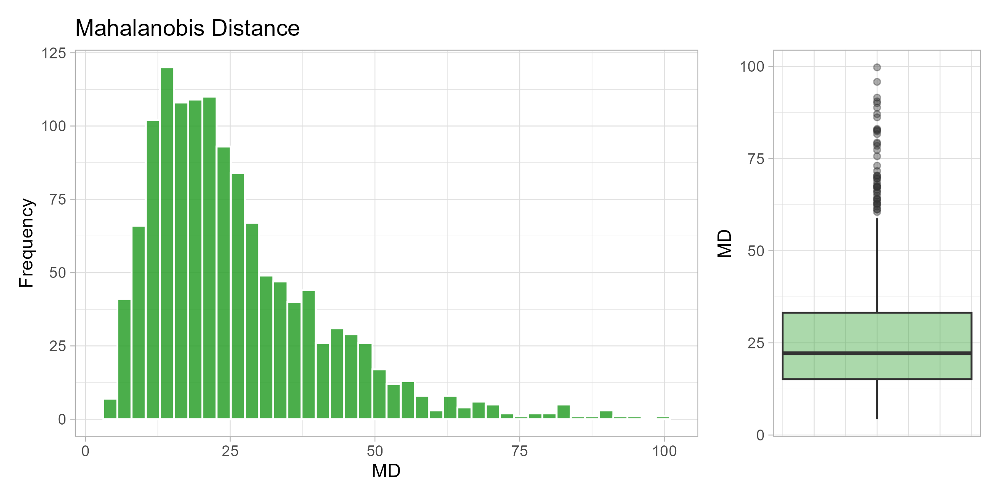
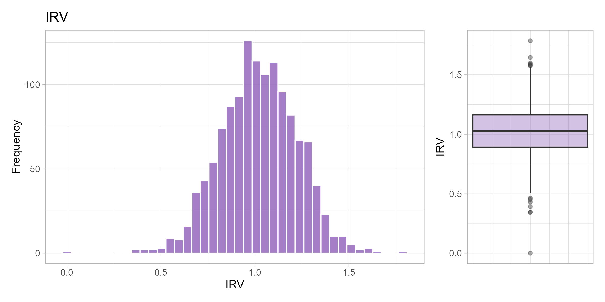
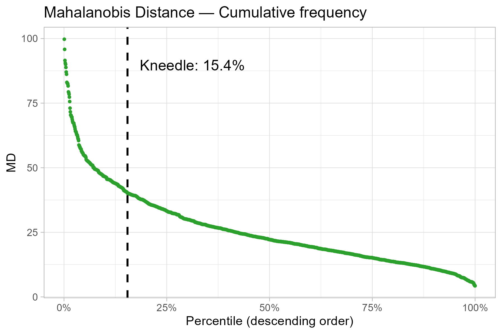
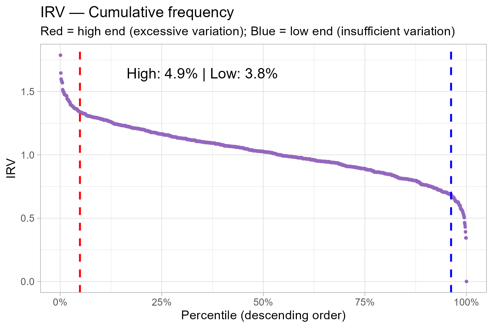

## Contextualization

The detection of Careless or Insufficient Effort Responding (C/IER) is an
essential step in the quality control of data obtained through self-report
questionnaires. C/IER occurs when respondents complete the instrument without
attention to the item content, compromising the validity of the psychometric
and substantive inferences derived from the data [@curran2016; @huang2026].

The analytical flow of this document follows two sequential levels of detection:

1. **Questionnaire:** procedural exclusions (a priori), including dropout,
   response time, and quality control items.
2. **WHOQOL Scale:** diagnostic post-hoc indicators (Laz.R, Longstring,
   Mahalanobis Distance, and IRV) with cut-off points estimated via the 
   Kneedle algorithm [@biemann2025].

## Data reading and preparation

The `data.csv` file contains the raw survey responses (separator `;`).
In this step, dropout records are removed, variables for the analytical flow
are selected, and the total response time (`TIME`) is derived.



## Procedural exclusions

Level 1 applies three procedures prior to calculating post-hoc indicators:
dropout removal, exclusion for response time below 208 seconds
(104 items × 2 s/item) [@huang2026], and exclusion for two or more failures
on quality control items (`CQ1-CQ3`) [@curran2016]. Every exclusion is
recorded in `exclusion_log.csv` with its reason and criterion.



## Calculation of C/IER indicators

Each indicator captures distinct manifestations of C/IER; their concurrent
presence offers stronger evidence than any single indicator alone [@curran2016;
@hong2020; @huang2026].

### Univariate visualization

::: {.content-visible when-format="html"}
::: {.panel-tabset}

#### Laz.R

{#fig-viz-lazr fig-alt="Histogram and boxplot of the Laz.R distribution."}

#### Longstring

{#fig-viz-longstr fig-alt="Histogram and boxplot of the Longstring distribution."}

#### Mahalanobis Distance

{#fig-viz-md fig-alt="Histogram and boxplot of the Mahalanobis distance distribution."}

#### IRV

{#fig-viz-irv fig-alt="Histogram and boxplot of the IRV distribution."}

:::
:::

::: {.content-visible unless-format="html"}
::: {#fig-univariate layout-ncol=2}

{#fig-viz-lazr-pdf}

{#fig-viz-longstr-pdf}

{#fig-viz-md-pdf}

{#fig-viz-irv-pdf}

Univariate distributions of C/IER indicators
:::
:::

### Cut-off points via Kneedle algorithm

The Kneedle algorithm is applied to the sorted (descending) curve of each indicator.
For **Laz.R**, **Longstring**, and **MD**, kneedle with `sign = -1` identifies
where extremely high values separate from the majority (right tail).
For **IRV**, `sign = -1` is used to detect excessively high IRV and
`sign = +1` for excessively low IRV, since both extremes can be considered suspicious.



### Plots with cut-off points

::: {.content-visible when-format="html"}
::: {.panel-tabset}

#### Laz.R

{#fig-cum-lazr fig-alt="Cumulative Laz.R curve with the Kneedle cut-off point."}

#### Longstring

{#fig-cum-longstr fig-alt="Cumulative Longstring curve with the Kneedle cut-off point."}

#### Mahalanobis Distance

{#fig-cum-md fig-alt="Cumulative Mahalanobis distance curve with the Kneedle cut-off point."}

#### IRV

{#fig-cum-irv fig-alt="Cumulative IRV curve with the high and low Kneedle cut-off points."}

:::
:::

::: {.content-visible unless-format="html"}
::: {#fig-cumulative layout-ncol=2}

{#fig-cum-lazr-pdf}

{#fig-cum-longstr-pdf}

{#fig-cum-md-pdf}

{#fig-cum-irv-pdf}

Cumulative frequency curves with Kneedle cut-off points
:::
:::

### C/IER Flags

For each indicator, a `_FLAG` variable is created (`1` = flagged,
`0` = not flagged) based on the Kneedle cut-off points.

> **Note:** Post-hoc indicators are **diagnostic**, they do not trigger automatic
> exclusion in isolation. The final decision below requires corroboration from
> at least two of four selected indicators.



### From diagnostic flags to final exclusions {#posthoc-decision}

The cut-offs above identify response patterns that warrant attention; they do
not, by themselves, prove that a respondent answered carelessly. Detection
methods are sensitive to different manifestations of C/IER and may also flag
unusual but valid response profiles. Consequently, combining every available
flag with an **OR** rule can increase sensitivity at the cost of specificity
and sample size [@curran2016; @hong2020]. Indiscriminate post-hoc removal may
also distort statistical and psychometric estimates when valid atypical
respondents are classified as inattentive [@wang2025b].

#### Consequences of alternative decision rules

The scenarios below make the cost of each possible rule explicit. The first
two use all five diagnostic flags. The next two remove Longstring from the
decision set, while retaining it as a descriptive diagnostic. The final two
show the Laz.R--MD screening alternative.



 

An OR rule across all five flags would remove 436 respondents (33.7%), leaving
859 observations. Even after removing Longstring from the decision set, an OR
rule would remove 344 respondents (26.6%). These reductions are difficult to
defend when a single post-hoc indicator can produce false positives. In
particular, Mahalanobis distance may overflag respondents when ordinal item
responses depart from the multivariate-normal assumptions used in conventional
outlier detection [@hong2020].

#### What the intersections show

Longstring and low IRV are invariability-oriented diagnostics, high IRV targets
excessive variation, and MD targets multivariate atypicality. Laz.R detects
predictable transitions, including straightlining, alternating, and diagonal
patterns, but it is not a general detector of random responding. Laz.R should
therefore be combined with complementary approaches, and its Kneedle cut-off
should support scrutiny and possible exclusion rather than be treated as proof
of carelessness [@biemann2025].



 

Of the 91 Laz.R flags, 76 (83.5%) are also Longstring flags. Counting both in
the composite rule would allow one narrow manifestation - repetitive or highly
predictable responding - to contribute two votes. Longstring remains useful
for diagnosis and teaching, but its narrower scope and empirical redundancy
with Laz.R justify excluding it from the final flag count. Conversely, 42 of
the 66 IRV-high cases are also flagged by MD, providing convergent evidence for
excessive variability or multivariate atypicality.



 

Only two respondents fail both Laz.R and MD, whereas 199 fail MD only and 89
fail Laz.R only. Requiring both would remove almost no cases, while using either
would identify 290 cases (22.4%) for case-by-case review. This can be a useful
screening pool, but it was not adopted as an automatic exclusion rule because
the indicators are nearly disjoint in this sample and MD-only evidence is not
sufficient to infer carelessness from ordinal responses [@hong2020; @ward2023].

#### Final rule: at least two of four decision flags

The final rule counts **Laz.R, MD, IRV high, and IRV low** and excludes a
respondent only when at least two of these four flags are present. It requires
corroboration, avoids deletion based on MD alone, and retains IRV as evidence
for both insufficient and excessive within-person variability. This follows
the recommendation to use multiple, context-appropriate indicators rather
than rely blindly on one index [@curran2016; @ward2023].

@hong2020 best-subset simulations support selecting a smaller group of
complementary indicators instead of a kitchen-sink combination, although their
specific subset and cut-offs are design-dependent and should not be imported
unchanged into the WHOQOL-Bref [@hong2020]. Plan A is therefore a transparent
teaching decision for this dataset, not a universal threshold.



 

Plan A removes 62 of the 1,295 eligible respondents (4.8%). The full audit log
preserves each excluded ID, indicator value, flag, composite count, and evidence
combination in `posthoc-exclusion-log.csv`.

#### Final analysis dataset



 

The final `whoqol_analysis.csv` contains 1,233 respondents, the `ID` column,
and `Q1-Q26`. Items Q3, Q4, and Q26 are reverse-scored only after the C/IER
indicators have been calculated on the response sequence as administered. For
substantive analyses, the unfiltered 1,295-case dataset can be retained as a
sensitivity condition. Large changes between filtered and unfiltered results
should be reported rather than used to choose whichever cleaning rule produces
the preferred result [@wang2025b].

## References {.unnumbered}

::: {#refs}
:::

